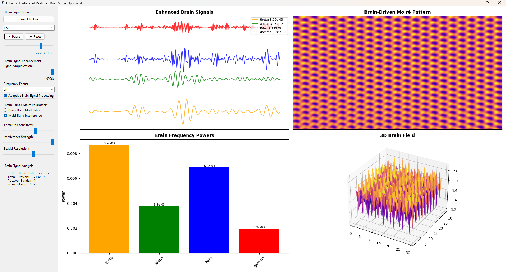

# EEG Moiré Visualizer: The Enhanced Entorhinal Modeler

UPDATE: Added the new modeler number 4 with interesting network synchronization mode that Claude somehow came up with. (Not based on the paper that inspired the previous code) 

This tool provides a real-time visualization of the Moiré interference patterns generated from real-world EEG data. It models the brain's electrical activity as a series of interfering wave fields, allowing you to see the emergent geometric structures that may underlie cognitive processes.

The primary goal is to take the faint, complex signals from a single EEG channel and amplify and translate them into a visible, dynamic, geometric landscape.



## Core Concept

The central hypothesis, inspired by computational neuroscience, is that coherent cognitive patterns can emerge from the interference of simpler, underlying neural oscillations (brainwaves).

This approach is heavily inspired by the paper:
*   **Blair, H. T., Welday, A. C., & Zhang, K. (2007). *Scale-Invariant Memory Representations Emerge from Moiré Interference between Grid Fields That Produce Theta Oscillations*. The Journal of Neuroscience.**

  https://pubmed.ncbi.nlm.nih.gov/17376982/

That paper proposed that the brain's hexagonal grid cells (part of the brain's "GPS") are formed by the Moiré interference of smaller, underlying "theta grids." This tool applies that principle to visualize the interference patterns driven by various brainwave frequencies from actual EEG recordings.

## Features

*   **Load Real EEG Data:** Loads and processes standard `.edf` format EEG files.
*   **Real-Time Moiré Generation:** Translates the filtered brainwave signals from a chosen channel into a 2D Moiré interference pattern.
*   **3D Brain Field Visualization:** Renders the Moiré pattern as a 3D topological surface.
*   **Brain Signal Enhancement:** Includes powerful tools to make faint biological signals visible:
    *   High-gain signal amplification.
    *   Adaptive noise reduction to clean up the signal.
*   **Two Interference Models:**
    *   **Brain Theta Modulation:** A model focused on how the theta rhythm modulates two underlying grids.
    *   **Multi-Band Interference:** A model where all active frequency bands (Theta, Alpha, Beta, Gamma) contribute to a final, complex pattern.

## Requirements

This project requires Python 3 and the libraries listed in `requirements.txt`.

*   **NumPy:** For numerical operations.
*   **Matplotlib:** for all 2D and 3D plotting.
*   **MNE-Python:** For reading and processing `.edf` EEG files.
*   **SciPy:** For signal filtering and analysis.

## How to Use

1.  **Clone or download** this repository.
2.  **Install dependencies** from your terminal:
    ```
    pip install -r requirements.txt
    ```
3.  **Run the script:**
    ```
    python EntorhinalModeler.py
    ```
4.  Click the **"Load EEG File"** button and select a `.edf` file.
5.  Choose a channel from the dropdown menu to begin visualization.

## Controls

*   **Load EEG File:** Opens a dialog to select a `.edf` file.
*   **Channel:** Select which EEG channel to analyze.
*   **Time Slider:** Scrub through the EEG recording to analyze different moments in time.
*   **Play/Pause/Reset:** Control the automatic playback of the time slider.
*   **Signal Amplification:** Boosts the strength of the raw EEG signal to make faint patterns more visible.
*   **Adaptive Brain Signal Processing:** Toggles a noise reduction filter.
*   **Brain-Tuned Moiré Parameters:** Adjust the sensitivity, strength, and resolution of the Moiré generation algorithm.

## License

This project is licensed under the MIT License.
